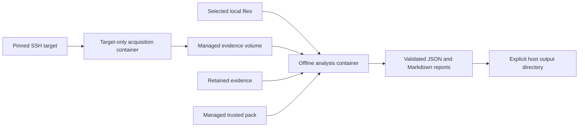

# Detection Goggles

Detection Goggles is an agentless Detection-as-Code runner for defensive labs. It
acquires explicitly selected files, runs trusted first-party static detections in
disposable rootless Podman containers, validates the results, and exports JSON and
Markdown reports.

The initial Detection Pack targets Hack The Box's **Malevolent ModMaker** Sherlock.
The repository neither includes nor downloads challenge artefacts. Supply only files
you are authorised to analyse. Detection Goggles is an independent project and is not
affiliated with or endorsed by Hack The Box.

## Project policy

This is a maintainer-developed project. External pull requests and contributions of
code, documentation or Detection Packs are not accepted. Security reporting and
coordinated disclosure are not supported. Do not send suspected vulnerabilities,
malware, credentials or sensitive evidence to the maintainer. Read
[SECURITY.md](SECURITY.md) before operating the software.

## Execution model

Podman is required for detector execution, including tests that run detections. The
host command is a launcher: each operation uses a disposable workload, and detector
code runs in a separate analysis container with networking disabled. There is no
native detector fallback when the runtime is missing or its checks fail.

SSH acquisition uses a saved target profile with a literal IPv4 address, port and
independently verified host-key fingerprint. A short-lived network initialiser
restricts a fresh rootless network namespace to that target and port before the
unprivileged acquisition workload starts. Analysis then runs offline without SSH
credentials. A separate downloader handles pack registry traffic.

Rootless containers share the host kernel. This boundary reduces access to host files,
credentials and networks; it does not provide the isolation of a separate guest
kernel or make arbitrary pack code safe. The initial integration target is native
Linux amd64 with cgroup v2, using Kali Linux and Podman 5.8.6. Operational validation
must be completed on the actual host; see [the container playbook](docs/operations/containers.md).



## Set up the controller

Install rootless Podman and its host prerequisites using the
[controller setup playbook](docs/operations/controller-setup.md), then install the
launcher from a trusted checkout:

```bash
python -m venv .venv
. .venv/bin/activate
python -m pip install -e .
scripts/container-build
dacctl runtime doctor
scripts/container-verify
```

The build records immutable local image IDs in
`${XDG_CONFIG_HOME:-~/.config}/detection-goggles/images.json`. Rebuild deliberately
when trusted source or dependencies change. Runtime commands do not silently pull a
new image or execute detectors on the host.

```bash
dacctl pack list
dacctl pack validate htb-malevolent-modmaker
```

## Analyse local files

```bash
dacctl run files htb-malevolent-modmaker \
  ./evidence/artifact-one \
  ./evidence/artifact-two
```

Selected files are copied into managed evidence storage. The container does not receive
a mount of your home directory or the full source directory. Directory recursion
requires `--recursive`; symbolic links and non-regular inputs are rejected by default.
Inputs are read as data and are never executed.

```bash
dacctl run files htb-malevolent-modmaker ./evidence --recursive
```

Defaults are 128 MiB per file, 512 MiB total, 1,000 files and a 10-second detector
timeout cap. CLI options can adjust these within the evidence contract's hard limits.
Reports are exported to `reports/<run-id>/report.json` and `report.md`. Raw snapshots
are removed after the run unless `--retain-evidence` is selected; retained snapshots
remain in managed storage and are not exported alongside reports.

```bash
dacctl run files htb-malevolent-modmaker ./evidence/sample --retain-evidence
dacctl evidence list
dacctl run evidence htb-malevolent-modmaker --run-id RUN_ID
dacctl evidence remove RUN_ID
```

An existing Evidence Bundle v1 directory can also be explicitly imported with
`dacctl run evidence htb-malevolent-modmaker ./saved-bundle`.

## Acquire named files over SSH

Register the target using its host-key fingerprint obtained through an independent
trusted channel:

```bash
dacctl target init lab \
  --host 192.0.2.10 \
  --port 22 \
  --host-key-fingerprint SHA256:REPLACE_WITH_VERIFIED_FINGERPRINT
```

Initialisation creates an encrypted key in managed storage and prints its public key.
Register that public key on a dedicated target account with access to the required
files. The private key stays in managed storage. Then run:

```bash
dacctl run ssh htb-malevolent-modmaker \
  --target lab \
  --user analyst \
  --remote-file /opt/evidence/artifact-one \
  --remote-file /opt/evidence/artifact-two
```

The core-owned Ansible transport fetches only explicitly named regular files. It does
not install an agent or run pack scripts on the target. Each acquisition has a fresh
network namespace restricted to the saved target and port. Host-key checking is strict;
free-form targets and `accept-new` are not available on `run ssh`.

An existing private key can be explicitly imported for a run with `--identity PATH`.
The host SSH directory and agent are not forwarded. `--ask-pass`, `--become` and
`--ask-become-pass` remain explicit options; passwords are never CLI arguments.

```bash
dacctl target list
dacctl target remove lab
```

Removing a target deletes its managed local credentials. Remove its public key from
the remote account separately. Volume deletion does not guarantee secure erasure.

## Results

Every rule produces an evaluation: `detected`, `not_detected`, `unknown`, `error` or
`not_applicable`. Only `detected` evaluations produce findings. A negative result is
not proof that a file is safe.

| Exit code | Meaning |
| ---: | --- |
| `0` | Complete evaluation with no detections |
| `1` | Complete evaluation with one or more detections |
| `2` | Partial acquisition, unavailable evidence or an operational error |

An error takes precedence over detections in the same run. JSON is the automation
record; Markdown is for analyst review. Exported reports can contain sensitive paths,
hashes and findings even though they omit raw evidence.

## Detection Packs

| Rule | Purpose |
| --- | --- |
| `MMM-001` | Go PE with AES-GCM and clustered file-transformation capability |
| `MMM-002` | PE with network retrieval and process-execution behaviour |
| `MMM-003` | Correlate loader and ransomware profiles on distinct artefacts |

These are explainable static heuristics. They do not embed unpublished challenge
answers, C2 addresses, keys, filenames or binary hashes. Packed or heavily stripped
binaries may require manual reverse engineering.

Packs are independently versioned deterministic archives. Installation verifies their
SHA-256 digest and validates their structure before placing new versions in managed
storage. An archive identical to the bundled pack is verified and reused from the image.
The registry downloader has no evidence or SSH credential mounts. Custom installation
destinations are rejected; select exact versions for repeatable runs.

```bash
dacctl pack build htb-malevolent-modmaker --output dist
dacctl pack verify ./dist/htb-malevolent-modmaker-0.1.2.tar.gz \
  --registry ./registry/packs.yml
dacctl pack install ./dist/htb-malevolent-modmaker-0.1.2.tar.gz \
  --sha256 5bbac3d60c288865b37afc4a3e7e34aa33d3d421376ec02f4ce31d565023f57b
```

Registry installation by ID requires the matching registry and immutable release
asset to have been published. GitHub Actions mirror `main` to GitLab and retain the
latest completed workflow runs; validation and pack publication are manual.

## Documentation and validation

- [Architecture](docs/ARCHITECTURE.md): components, data contracts and trust boundaries.
- [Operational playbooks](docs/operations/README.md): setup, containers, acquisition,
  replay, pack lifecycle and troubleshooting.
- [Maintainer development](DEVELOPMENT.md): container-based validation and releases.
- [Security policy](SECURITY.md): operational limits and unsupported security reporting.

Run the test suite through `scripts/container-test`. A successful source review or
static check does not establish that the rootless runtime, target-only networking,
credential separation or cleanup works on a particular host. Record real integration
results before describing a deployment as validated.
