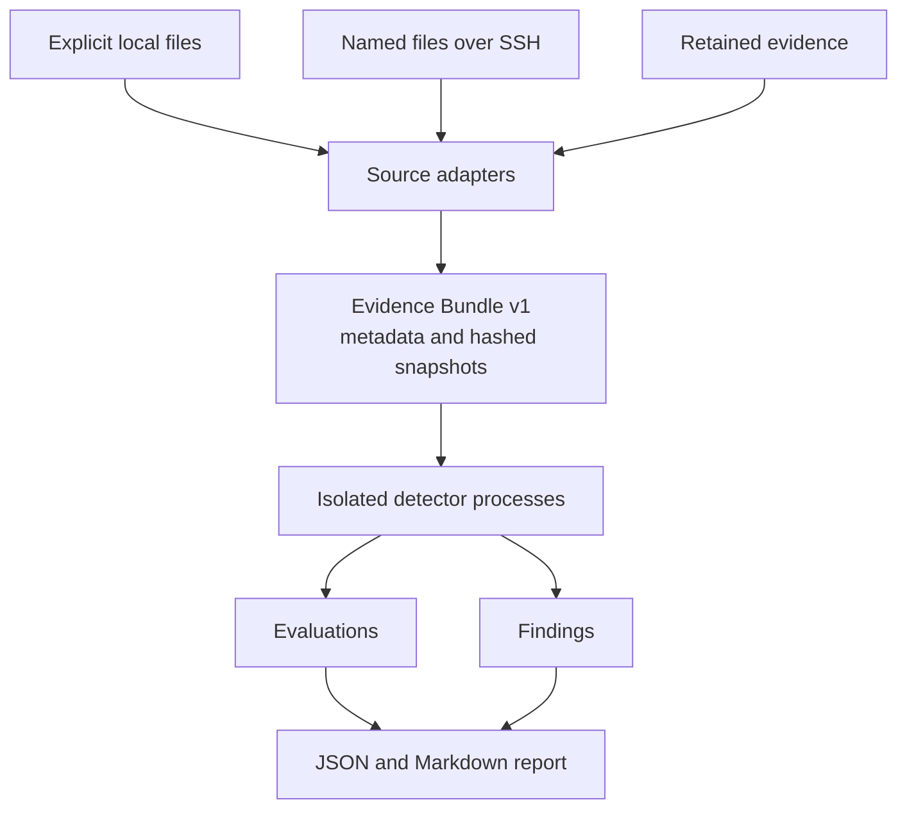

# Detection Goggles

Detection Goggles is a source-agnostic Detection-as-Code runner for defensive labs.
It acquires evidence once, runs first-party detections locally in isolated subprocesses,
validates every result, and writes machine-readable and analyst-readable reports.

The initial first-party Detection Pack targets Hack The Box's **Malevolent ModMaker**
Sherlock. Detection Goggles does not include or download any Hack The Box artifacts.
You provide the files you are authorized to analyze.

> Detection Goggles is an independent project. It is not affiliated with or endorsed
> by Hack The Box.

## Project policy

This is a maintainer-developed project. External pull requests and contributions of
code, documentation, or Detection Packs are not accepted. Security reporting and
coordinated disclosure are not supported; do not send suspected vulnerabilities,
malware, credentials, or sensitive evidence to the maintainer. Read
[SECURITY.md](SECURITY.md) before operating the software.

## Documentation

- [Architecture](docs/ARCHITECTURE.md): components, Mermaid data flows, contracts,
  trust boundaries, packaging, and extension rules.
- [Operational playbooks](docs/operations/README.md): controller setup, local analysis,
  SSH acquisition, replay, pack lifecycle, and troubleshooting.
- [Security policy](SECURITY.md): unsupported security-reporting posture and known
  operational boundaries.
- [Maintainer development guide](DEVELOPMENT.md): internal pack contract and validation
  requirements.

## What works in v0.1

- repeatable local analysis of one or more explicitly selected files;
- bounded SSH/Ansible acquisition of explicitly selected remote files;
- evidence snapshots with SHA-256 integrity metadata;
- replay of retained evidence without touching the original files;
- schema-validated Detection Packs, rules, evaluations, findings, and reports;
- one subprocess per detector, with a scrubbed environment and resource limits;
- JSON and Markdown reports;
- reproducible, independently installable pack archives;
- the first-party `htb-malevolent-modmaker` pack.

Malevolent ModMaker is artifact-driven, so the SSH source fetches named files rather
than collecting unrelated host telemetry. The pack never supplies remote tasks and its
detectors never execute on the target.

## Architecture



An evaluation describes every rule outcome: `detected`, `not_detected`, `unknown`,
`error`, or `not_applicable`. Only `detected` evaluations produce findings. This keeps
“no match” distinct from missing evidence or a failed detector.

The complete component model, trust boundaries, data contracts, and execution
sequences are documented in [docs/ARCHITECTURE.md](docs/ARCHITECTURE.md).

## Install for development

Python 3.11 or newer is required.

```bash
python -m venv .venv
. .venv/bin/activate
python -m pip install -e '.[dev]'
```

Install the optional, core-owned Ansible transport when remote acquisition is needed:

```bash
python -m pip install -e '.[dev,ssh]'
```

List and validate the source-tree pack:

```bash
dacctl pack list
dacctl pack validate htb-malevolent-modmaker
```

`pack list` includes the resolved source path. Detection Goggles never searches an
unrelated current working directory for packs; non-default roots must be supplied with
`--pack-root` or `DAC_PACK_PATH`.

## Analyze Malevolent ModMaker files

Extract the challenge archive in an isolated malware-analysis environment, then name
the files explicitly:

```bash
dacctl run files htb-malevolent-modmaker \
  ./evidence/artifact-one \
  ./evidence/artifact-two
```

Directories are rejected unless recursion is explicitly authorized:

```bash
dacctl run files htb-malevolent-modmaker ./evidence --recursive
```

Symbolic links, devices, sockets, and FIFOs are rejected by default. Inputs are copied
read-only into an owner-only temporary directory and are never executed or modified.
Default limits are 128 MiB per file, 512 MiB in total, and 1,000 files; each can be
lowered on the command line.

Reports are written to `reports/<run-id>/report.json` and `report.md`. Raw snapshots are
deleted after evaluation unless retention is explicitly requested:

```bash
dacctl run files htb-malevolent-modmaker ./evidence/sample \
  --retain-evidence
```

Replay the retained bundle later:

```bash
RUN_ID="replace-with-original-run-id"
dacctl run evidence htb-malevolent-modmaker \
  "./reports/${RUN_ID}/evidence"
```

### Acquire named files over SSH

The SSH adapter checks and fetches only absolute POSIX paths supplied with
`--remote-file`, then applies the normal controller-side snapshot and detector
pipeline. The current adapter targets POSIX SSH hosts; the files themselves can be
Windows executables:

```bash
dacctl run ssh htb-malevolent-modmaker \
  --host 10.10.10.10 \
  --user htb \
  --remote-file /opt/evidence/artifact-one \
  --remote-file /opt/evidence/artifact-two \
  --acquisition-timeout 600 \
  --identity ~/.ssh/id_ed25519
```

SSH-agent authentication is used automatically when available. To use a password,
request Ansible's interactive prompt with `--ask-pass`; there is deliberately no
password command-line option. Host-key verification is strict by default. For a new,
disposable lab host, `--host-key-policy accept-new` records the first-seen key while
still rejecting a changed key.

Remote final-component symbolic links and non-regular paths are rejected. Failed fetch
or checksum outcomes are never admitted merely because a residual local file exists.
The same file-count and byte limits apply before transfer where remote metadata permits.
`--acquisition-timeout` bounds the complete Ansible run, while `--connection-timeout`
bounds connection establishment. `--become` and `--ask-become-pass` are opt-in; avoid
elevation unless the selected path requires it. The `host` command is accepted as an
alias for `ssh`.

### Exit codes

| Code | Meaning |
| ---: | --- |
| `0` | Evaluation completed and no detections matched |
| `1` | One or more detections matched |
| `2` | Acquisition was partial, evidence was unavailable, or an operational error occurred |

## Pack distribution

Build the pack independently of the core wheel:

```bash
dacctl pack build htb-malevolent-modmaker --output dist
```

The command creates a deterministic archive through a temporary file, verifies that its
expanded size and entry count are installable, and prints its SHA-256 digest. Once the
matching registry file and immutable GitHub release asset have actually been published,
install the independently packaged first-party pack by ID:

```bash
dacctl pack available
dacctl pack install htb-malevolent-modmaker
```

Before that publication step, use the digest-verified local archive workflow below;
the default network registry is a release interface, not a development fallback.

The registry download is accepted only when its digest matches the registry. Installing
a local archive requires an explicit digest:

```bash
dacctl pack install ./htb-malevolent-modmaker-0.1.1.tar.gz \
  --sha256 79083d7e291a4687edae28c91df153c652772899c483a34bc91ee47eeb732e1b
```

The same archive can be checked against a downloaded registry before installation:

```bash
dacctl pack verify ./htb-malevolent-modmaker-0.1.1.tar.gz \
  --registry ./registry/packs.yml
```

GitHub Actions are not used by this repository. Pack releases are prepared manually:
the maintainer runs the validation commands below, builds the archive twice to confirm
reproducibility, verifies its SHA-256 against `registry/packs.yml`, and then uploads the
archive and checksum to the matching GitHub release. Pack code is executable code, so
only install artifacts from a source you trust and always verify the published digest.

## Malevolent ModMaker detections

| Rule | Purpose |
| --- | --- |
| `MMM-001` | Go PE with AES-GCM and clustered file-transformation capability |
| `MMM-002` | PE with network retrieval and process-execution behavior |
| `MMM-003` | Higher-confidence correlation of loader and ransomware profiles on distinct artifacts |

These are explainable static heuristics, not fixed challenge answers. They do not embed
an unpublished C2 address, key, filename, or binary hash. Packed or heavily stripped
binaries may require manual reverse engineering.

## Maintainer development

```bash
PACK_VERSION="0.1.1"
ruff check .
ruff format --check .
pytest
python -m build
dacctl pack build htb-malevolent-modmaker --output dist-a
dacctl pack build htb-malevolent-modmaker --output dist-b
cmp "dist-a/htb-malevolent-modmaker-${PACK_VERSION}.tar.gz" \
  "dist-b/htb-malevolent-modmaker-${PACK_VERSION}.tar.gz"
dacctl pack verify "dist-a/htb-malevolent-modmaker-${PACK_VERSION}.tar.gz" \
  --registry registry/packs.yml
```

See the [operational playbooks](docs/operations/README.md) for run procedures,
[DEVELOPMENT.md](DEVELOPMENT.md) for the internal pack contract and release procedure,
and [SECURITY.md](SECURITY.md) for the execution and evidence threat model.
