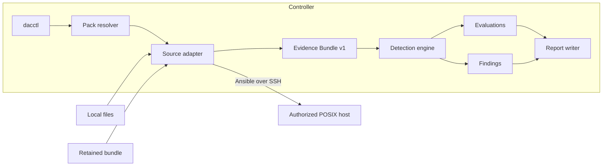
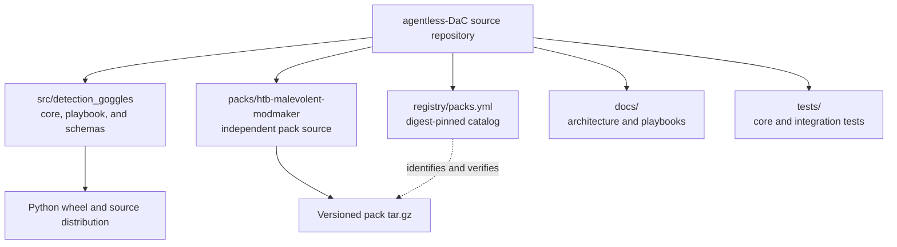
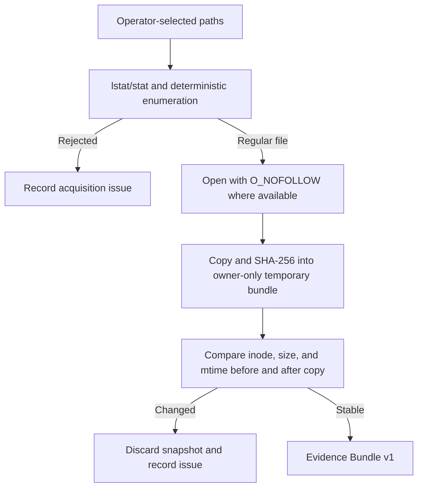
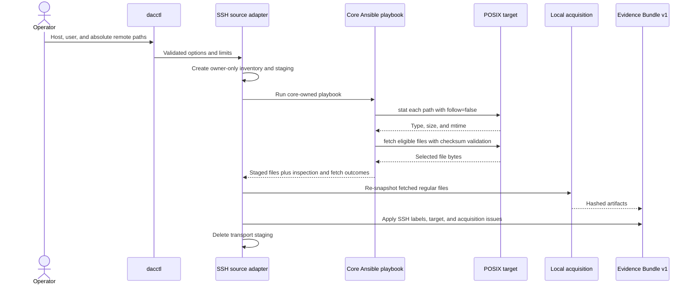
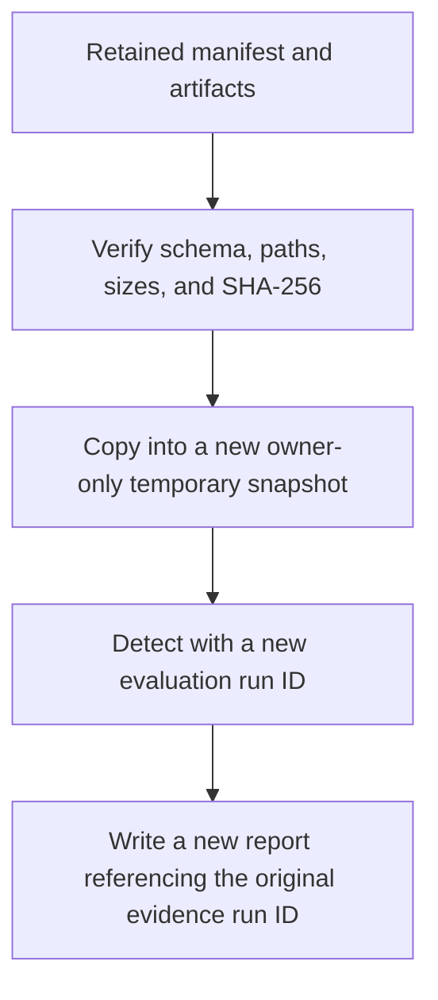

# Detection Goggles architecture

## Purpose and scope

Detection Goggles is an agentless Detection-as-Code runner for defensive lab
artifacts. The core acquires immutable-enough local snapshots, normalizes them into one
evidence contract, invokes trusted first-party Detection Pack code on the controller,
and writes validated findings and evaluations.

The current implementation is intentionally file-centric. It supports:

- explicitly selected local files and opt-in directory recursion;
- explicitly selected files fetched from a POSIX host over Ansible and SSH;
- replay of a retained Evidence Bundle v1 directory;
- one first-party pack, `htb-malevolent-modmaker`.

It does not provide continuous monitoring, an endpoint agent, arbitrary remote probes,
host-wide telemetry collection, a daemon, a service API, an HTML renderer, or a secure
sandbox for untrusted pack code.

## System context



The SSH branch ends at evidence acquisition. Detection Pack scripts are never copied
to or executed on the target.

## Repository and distribution boundaries



The core is built as a Python wheel or source distribution. A pack is built separately
as `<pack-id>-<version>.tar.gz`; it is not embedded in the wheel. Installed packs are
stored by identity and version under:

```text
${XDG_DATA_HOME:-~/.local/share}/detection-goggles/packs/<pack-id>/<version>/
```

Pack resolution checks trusted roots, in order, and uses the newest requested version
from the first root containing that pack ID:

1. each global `--pack-root` argument;
2. each path in `DAC_PACK_PATH`;
3. the source-tree `packs` directory only when the core is running from a checkout;
4. the per-user pack directory above.

The current directory is never an implicit pack root. Duplicate ID/version identities
across explicit discovery roots are rejected rather than silently shadowed, and
`dacctl pack list` prints each resolved path.

A pack may depend on a compatible core version but may not depend on another pack.

## Component model

| Component | Responsibility | Important boundary |
| --- | --- | --- |
| CLI | Parse commands, resolve packs, select a source, present exit codes | Does not accept passwords as arguments |
| Pack resolver | Discover packs and validate manifests, rules, entrypoints, and core compatibility | Rejects undeclared rules and paths escaping the pack |
| Local source | Enumerate authorized paths and snapshot regular files | Directory recursion and symlink following require explicit flags |
| SSH source | Inspect and fetch named remote files through a core-owned playbook | Pack code never runs remotely |
| Replay source | Validate and re-snapshot a retained bundle | Paths, hard/operator limits, size, and SHA-256 must match |
| Evidence layer | Expose normalized metadata and controller-local content paths | Artifact references must remain inside the private bundle root |
| Detection engine | Run one rule and input batch per subprocess | Subprocess controls are resource limits, not a security sandbox |
| Report writer | Produce owner-only JSON and Markdown output | Raw artifacts are omitted unless retention is requested |
| Archive installer | Build deterministic packs and extract downloaded packs | Rejects traversal, links, devices, duplicates, and oversized archives |
| Registry client | Resolve compatible versions and download archives | Network registry and pack URLs must use credential-free HTTPS |

## Canonical evidence model

Every source becomes an Evidence Bundle v1 before detection:

```text
evidence/
├── manifest.json
└── artifacts/
    ├── file-0001
    └── file-0002
```

The manifest records:

- a unique evidence run ID and UTC creation time;
- source type (`local_files` or `ssh`), requested inputs, and SSH target when relevant;
- each artifact's stable ID, display path, size, SHA-256, media type, modification time,
  content reference, and acquisition source;
- every partial-acquisition issue.

An artifact's `content_ref` is a relative path matching
`artifacts/file-<number>`. Resolution verifies that it stays beneath the bundle root,
exists, is a regular file, and is not a symbolic link. Bundle verification hashes every
artifact and compares its size and digest with the manifest.

The schemas are authoritative:

| Contract | Schema |
| --- | --- |
| Pack manifest | `pack.schema.json` |
| Rule metadata | `rule.schema.json` |
| Evidence bundle | `evidence-bundle.schema.json` |
| File artifact | `artifact.schema.json` |
| Detector response | `detector-output.schema.json` |
| Evaluation | `evaluation.schema.json` |
| Finding | `finding.schema.json` |
| Report | `report.schema.json` |
| Distribution registry | `registry.schema.json` |

All schemas are packaged with the core under
[`src/detection_goggles/schemas/`](../src/detection_goggles/schemas/).

## Local acquisition sequence



Defaults are 128 MiB per artifact, 512 MiB per run, 1,000 files, no recursion,
and no symbolic-link following. Hard contract ceilings are 1 GiB per artifact, 4 GiB
per bundle, and 5,000 artifacts. Devices, sockets, FIFOs, and other non-regular inputs
are rejected.

## SSH acquisition sequence



The inventory contains host, port, user, and optional host-key arguments, but no
password. `--ask-pass` and `--ask-become-pass` delegate interactive prompting to
Ansible. The Ansible environment is allowlisted, while `SSH_AUTH_SOCK` is forwarded so
an existing agent can be used. Host-key checking is strict unless the operator selects
`accept-new`.

The playbook uses only fully qualified `ansible.builtin.stat`, `copy`, `set_fact`, and
`fetch` actions. Final-component links are not followed. Remote metadata is used to
select files within configured limits before transfer; controller-side acquisition
enforces those limits again after transfer to handle changes and races. Inspection and
fetch failures retain their per-file failure state. A failed or missing fetch outcome is
never accepted because a destination file happens to exist. The connection timeout
bounds each SSH connection attempt; a separate acquisition timeout terminates the
complete Ansible process group.

## Evidence replay sequence

Replay never evaluates directly against the retained directory:



This preserves the original evidence directory and exposes tampering before detectors
run. Replay applies the same configurable defaults as acquisition and always enforces
the hard evidence-contract ceilings before hashing artifact content.

## Detection Pack contract

The pack manifest declares identity, stable `X.Y.Z` semantic version, compatible core range, artifact
platform, sources, remote-execution policy, rule IDs, and report formats. The manifest's
rule list is authoritative, and the report writer emits only the declared formats.

Each rule resides at:

```text
detections/<RULE-ID>/
├── rule.yml
└── detect.py
```

Rule metadata is declarative. It includes title, description, severity, confidence,
tags, optional MITRE ATT&CK metadata, required artifact kinds, scope, entrypoint, and
timeout. The current engine is `python-subprocess` and supports two scopes:

- `artifact`: one subprocess invocation per artifact;
- `bundle`: one invocation with every artifact, intended for correlation.

Pack manifests may advertise the SSH source while declaring
`remote_execution: false`. No pack collector or remote entrypoint is currently
supported.

## Detector protocol and isolation

The engine starts the rule entrypoint with the current Python interpreter in isolated
mode:

```text
python -I /absolute/path/to/detect.py
```

It sends one compact JSON request on standard input:

```json
{
  "protocol_version": 1,
  "rule": {"id": "MMM-001"},
  "artifacts": [
    {
      "id": "file-0001",
      "kind": "file",
      "display_path": "sample.bin",
      "size": 1234,
      "sha256": "...",
      "media_type": "application/octet-stream",
      "content_path": "/private/bundle/artifacts/file-0001"
    }
  ]
}
```

The detector must write exactly one UTF-8 JSON object to standard output with a status
and match list. The output is capped at 1 MiB and validated before findings are built.
Referenced artifact IDs must belong to the detector's request.

Each detector receives a private working directory and a scrubbed environment. On
POSIX, the engine also attempts to limit CPU time, output file size, address space, and
open file descriptors. It applies the lower of the rule timeout and operator timeout,
and terminates the detector process group on timeout or completion.

These controls contain mistakes and bound resource use; they do not stop malicious
pack code from accessing resources available to the controller account. Pack trust is
therefore a primary architecture boundary.

## Evaluation and finding semantics

Every rule invocation produces an evaluation, even when it does not produce a finding:

| Status | Meaning |
| --- | --- |
| `detected` | The detector returned one or more schema-valid matches |
| `not_detected` | Required evidence was available and no match was found |
| `unknown` | The detector could not reach a detection conclusion |
| `not_applicable` | No suitable artifact was available |
| `error` | Execution, timeout, protocol, or validation failed |

Only `detected` evaluations create findings. A finding contains rule identity, title,
severity, confidence, subjects, a bounded summary, structured evidence, optional
locations, and MITRE ATT&CK metadata.

## Reporting and retention

The report writer creates a unique owner-only directory beneath the selected output
root:

```text
reports/<run-id>/
├── report.json
├── report.md
└── evidence/          present only with --retain-evidence
```

JSON is the schema-validated machine-readable record. Markdown escapes untrusted values before rendering
them. Reports contain artifact metadata and display paths, not raw artifact content.
Retention copies the verified manifest and only the referenced artifacts into the
report directory. Report files use mode `0600` and directories use mode `0700` when the
platform honors POSIX permissions.

## Pack build, registry, and installation

The pack builder creates a deterministic tar archive with sorted paths, normalized
ownership, normalized modes, zero timestamps, and a gzip timestamp of zero. Generated
bytecode and `__pycache__` directories are excluded. Builder-side entry-count and
expanded-size checks match the installer. Compression is completed and synchronized in
a private temporary file before an atomic no-overwrite link publishes the final name.

The registry maps pack identity and version to its compatible core range, platform,
archive name, SHA-256, HTTPS URL, and release tag. Registry installation:

1. downloads a size-limited registry over HTTPS or reads a local regular file;
2. resolves the newest compatible requested version;
3. downloads the archive over credential-free HTTPS;
4. verifies its SHA-256 before extraction;
5. safely extracts and validates the pack;
6. checks the archive identity and version against the registry;
7. atomically moves it into the versioned user pack directory.

Local archive installation requires the operator to supply `--sha256`. Installation
rejects absolute or ambiguous paths, POSIX and Windows traversal forms, links, devices,
duplicates, excessive member counts, and excessive expanded size.

## Trust boundaries and residual risks

| Asset or actor | Trust assumption | Residual risk |
| --- | --- | --- |
| Input artifact | Untrusted data | Parser bugs or resource pressure in detector logic |
| First-party pack | Trusted executable code | Subprocess is not an OS sandbox |
| Remote target | Authorized but potentially unstable or hostile | Metadata/fetch race; misleading remote metadata |
| Ansible and Python dependencies | Trusted installed software | Dependency compromise or incompatible update |
| Registry | Integrity metadata source | A compromised registry can publish a new malicious pack and matching digest |
| Controller account | Security boundary | Pack code can access what this account can access |
| Retained evidence and reports | Sensitive operator data | Paths, hashes, findings, and optional raw artifacts can disclose information |

The [security policy](../SECURITY.md) documents operational mitigations and explicitly
states that security reporting is not supported.

## Extension rules

Future work should preserve these invariants:

- source adapters terminate at Evidence Bundle v1;
- detectors consume evidence and do not acquire it independently;
- pack-specific code does not run remotely by default;
- every new data shape receives a versioned schema;
- every rule invocation produces a validated evaluation;
- pack archives remain independently buildable and installable;
- packs depend on the core, never on other packs;
- credentials remain outside packs, reports, registries, and detector requests.
