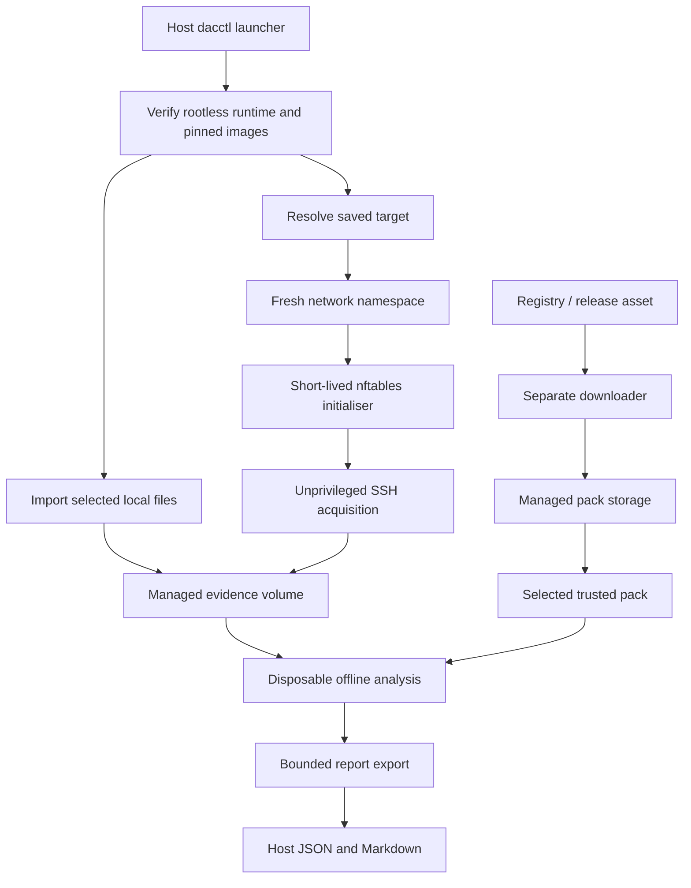

# Detection Goggles architecture

## Purpose and scope

Detection Goggles is an agentless, file-focused Detection-as-Code runner. The host CLI
orchestrates disposable rootless Podman workloads. Source adapters acquire selected
files into a common evidence contract, trusted first-party detections run offline, and
validated JSON and Markdown reports are exported to the host.

The supported journeys are explicit local-file analysis, named-file acquisition from a
saved POSIX SSH target, replay of retained evidence, and independently packaged
Detection Pack management. The initial pack is `htb-malevolent-modmaker`.

There is no endpoint agent, continuous monitoring, host-wide telemetry collection,
daemon, service API or HTML renderer. Detectors neither execute input artefacts nor
run on the remote target.

## Container execution boundary



Every detector invocation, including test execution, occurs inside an approved
container workload. Runtime checks fail closed; there is no automatic native fallback.
The host launcher owns orchestration, input admission, configuration and final export.

Analysis uses a read-only image, an unprivileged account, a private temporary
filesystem, dropped capabilities, resource controls and no network. It receives only
the selected evidence and pack. Host homes, SSH directories, source trees and
container-engine sockets are not workload mounts.

For SSH, a rootless namespace exists only for the operation. Before acquisition starts,
a short-lived initialiser installs nftables rules allowing the saved IPv4 address and
SSH port. Only the initialiser receives the namespace's network-administration
capability. The acquisition worker has no such capability and cannot broaden egress.
After acquisition, analysis runs in a separate offline container without target keys.

Containers share the host kernel. Rootless execution reduces authority and file
exposure but is not a separate-kernel virtual-machine boundary. The host account,
kernel, Podman, OCI runtime and network backend remain trusted.

## Images and runtime verification

The build selects reviewed application sources and pinned dependencies. It records
immutable local runtime, network and test image IDs in:

```text
${XDG_CONFIG_HOME:-~/.config}/detection-goggles/images.json
```

A command does not silently pull a replacement tag. Rebuild images deliberately when
trusted code or dependencies change. Developer tools belong in the test image rather
than the production runtime. `dacctl runtime doctor` checks the execution
prerequisites; `scripts/container-test` and `scripts/container-verify` exercise the
container workflow.

The initial integration target is native Linux amd64 with cgroup v2, initially Kali
Linux and Podman 5.8.6. Source inspection, syntax checks and mock tests are distinct
from successful integration on that host. The [container playbook](operations/containers.md)
defines the required operational checks.

## Managed state

Raw evidence, target private keys and installed packs live in project-managed Podman
volumes. Temporary workloads use operation-specific names and labels. Metadata under

```text
${XDG_DATA_HOME:-~/.local/share}/detection-goggles/controller/
```

records target and retained-evidence references. Target metadata contains a name,
literal IPv4 address, port, host-key fingerprint and managed volume reference.
Private keys and raw artefacts are not embedded in that metadata.

Target initialisation creates an encrypted key and pinned known-host data. The public
key is printed for operator registration. An explicitly selected existing identity
can be imported for one run without exposing the operator's entire SSH directory or
host agent.

Retention preserves a managed evidence volume. `evidence list` discovers retained
runs, `run evidence --run-id` replays one, and `evidence remove` removes the named
retained state. `target remove` removes the named local profile and credentials;
remote public-key revocation remains an operator action. Removal is not guaranteed
secure erasure.

## Canonical evidence contract

Every source produces Evidence Bundle v1:

```text
evidence/
├── manifest.json
└── artifacts/
    ├── file-0001
    └── file-0002
```

The manifest records the evidence run ID, UTC creation time, source metadata, requested
inputs and acquisition issues. Each artefact has an ID, display path, size, SHA-256,
media type, modification time and relative content reference.

Local import snapshots explicitly selected regular files. Recursion requires an
explicit option; links are rejected by default and cannot escape a selected directory.
Descriptor-based copying checks that the input did not change during acquisition.
SSH obtains named absolute regular files through the core-owned Ansible playbook,
then applies the normal snapshot and integrity checks.

Defaults are 128 MiB per file, 512 MiB per run and 1,000 files. Hard ceilings are 1 GiB
per file, 4 GiB per bundle and 5,000 files. Limit failures and unavailable files produce
acquisition issues rather than a clean negative result.

Replay validates the manifest, paths, regular-file status, sizes and SHA-256 hashes
before taking a new snapshot. It never evaluates directly against the retained source.
The new report has a new evaluation run ID and references the original evidence ID.
An explicitly selected external bundle may be imported for replay; ordinary report
export never includes such a raw bundle.

## Detection Packs and protocol

Packs remain separate from the core wheel. Their manifests declare stable `X.Y.Z`
versions, compatible core ranges, sources, execution policy, rules and report formats.
Packs may depend on the core but not on another pack. A source-tree pack or an
explicitly selected pack root is a read-only container input, not a host execution location.

Each rule has `detections/<RULE-ID>/rule.yml` and a Python entrypoint. The manifest's
rule list is authoritative. Validation rejects missing entrypoints, undeclared rules
and paths escaping the pack.

Inside offline analysis, the engine invokes entrypoints using isolated Python mode.
The `python-subprocess` rule engine remains the inner protocol executor; the mandatory
outer boundary is the container. Artefact-scope rules run once per artefact, while
bundle-scope rules receive the entire evidence set for correlation.

Each invocation receives one JSON request with protocol version 1, rule identity and
selected artefact metadata/content paths. It emits exactly one UTF-8 JSON object.
Output is bounded and schema-validated; referenced artefact IDs must belong to the
request. Private working directories, scrubbed environments, process-group cleanup
and rule/operator timeouts also apply inside the workload.

Pack archives are deterministic and independently installable. Builds normalise
ordering, ownership, modes and timestamps. Installation verifies SHA-256 before safe
extraction and validates identity, version and core compatibility. Unsafe paths,
links, devices, duplicate members and excessive sizes/counts are rejected.

Network registry operations use a separate disposable downloader. It has registry
network access but no evidence or target credentials. Installed packs enter managed
storage; arbitrary `--destination-root` paths are rejected. Published registry
metadata identifies releases; a digest match is integrity evidence, not a guarantee
that pack code is trustworthy.

## Evaluation, reporting and export

Every rule invocation produces an evaluation:

| Status | Meaning |
| --- | --- |
| `detected` | One or more valid matches |
| `not_detected` | Required evidence was available and no rule matched |
| `unknown` | No conclusive detection result |
| `not_applicable` | No suitable artefact was available |
| `error` | Execution, timeout, protocol or validation failed |

Only `detected` evaluations create findings. Findings include rule identity, severity,
confidence, subjects, summaries, structured evidence and optional locations/ATT&CK
metadata. Schemas for packs, rules, artefacts, bundles, detector output, evaluations,
findings, reports and registries ship under `src/detection_goggles/schemas/`.

Reports are generated in managed storage, then validated and exported through a
bounded regular-file path to:

```text
reports/<run-id>/
├── report.json
└── report.md
```

Export refuses unsafe members and existing destinations. Files and directories use
owner-only permissions where supported. Markdown escapes untrusted values, but the
report remains untrusted text and may contain sensitive paths, host identifiers,
hashes and findings. Raw evidence and private keys are never part of ordinary export.

Exit code `0` means complete with no detections; `1` means complete with detections;
`2` means an acquisition issue, unknown result or operational error. An incomplete
run can still contain findings. A negative result is not proof of safety.

## Extension invariants

- Source adapters terminate at the common evidence contract.
- Detection and tests cannot bypass the container boundary.
- Acquisition credentials and network access do not reach analysis.
- Network policy is installed before acquisition starts.
- Inputs and exports are explicit, bounded and independently validated.
- Data shapes use versioned schemas and every invocation produces an evaluation.
- Packs remain independently versioned and depend only on the core.
- Lifecycle cleanup targets only state owned by the operation or explicitly selected
  retained state.

[SECURITY.md](../SECURITY.md) records the threat model and unsupported security-reporting
policy. The [operational playbooks](operations/README.md) describe normal use.
